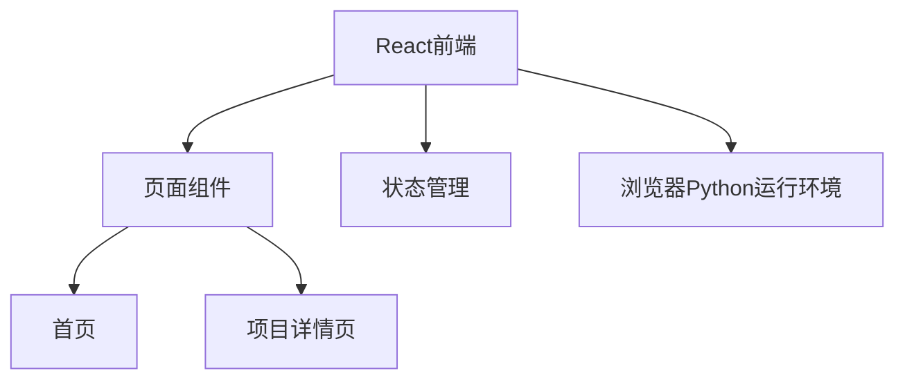

## 1. Architecture Design


## 2. Technology Description
- Frontend: React@18 + TypeScript + tailwindcss@3 + vite
- Initialization Tool: vite-init
- Backend: None（纯前端项目）
- Python运行环境: Pyodide（浏览器端Python解释器）

## 3. Route Definitions
| Route | Purpose |
|-------|---------|
| / | 首页，项目列表 |
| /project/:id | 项目详情页 |

## 4. 项目数据结构
### 4.1 项目类型定义
```typescript
interface Project {
  id: number;
  title: string;
  description: string;
  dataset: {
    filename: string;
    fields: Array<{
      name: string;
      meaning: string;
      type: string;
    }>;
    sampleData: string[][];
  };
  codeTemplate: string;
  expectedResults: string[];
  advancedTasks: string[];
}
```

### 4.2 10个练习项目数据
包含完整的10个项目数据，按指定顺序排列：
1. 销售数据基础探查与数据清洗
2. 销售数据分组聚合分析
3. 电商购物车转化漏斗分析
4. 客户聚类分群分析
5. 销售数据可视化分析
6. A/B 测试统计分析
7. 时间序列分析
8. 特征工程
9. 异常值检测
10. 多数据集合并与综合分析
